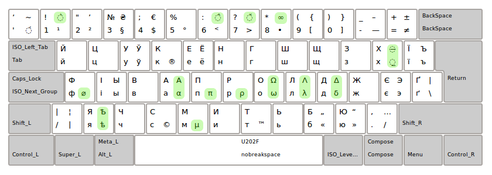

# xrb_symbols_ua

Доповнення розкладки [Ukrainian Unicode](https://r2u.org.ua/wiki/keyboard/UkrainianUnicode) символами,
які знадобилися нам у нашій діяльності, призначене для використання з xkb (X KeyBoard extension).
Докладніше про спосіб доповнень розкладки можна прочитати у статті
[Custom keyboard layout definitions](https://help.ubuntu.com/community/Custom keyboard layout definitions),
тут ми просто пропонуємо у готовому вигляді наші власні зміни.

## Внесені зміни

До тих символів, що йдуть «з коробки», додано символ діаметру ⌀ і нескінченості ∞, деякі грецькі літери, що можуть зустрічатися
в простих технічних текстах (6.81kΩ, 125μA, sin(*ωt*) і подібне), літера ѣ і додаткові діакритичні знаки
[gravis](https://uk.wikipedia.org/wiki/Гравіс_(діакритичний_знак)), [acutus](https://uk.wikipedia.org/wiki/Акут),
[circumflex](https://uk.wikipedia.org/wiki/Циркумфлекс) і [caron](https://uk.wikipedia.org/wiki/Гачек),
а також підкреслення і закреслення тексту.

Всі зроблені зміни позначені на цьому знімкові екрану:

## Використання
Файлом [ua](ua) з цього репозиторію слід замінити файл `/usr/share/X11/xkb/symbols/ua`
у вашій системі (про всяк випадок збережіть старий файл, наприклад, за допомогою `cp ua ua.original`).
Після заміни файлу, щоб відразу скористатися змінами, слід виконати команду `dpkg-reconfigure xkb-data`
(не забуваємо про права адміністратора для перелічених дій).
